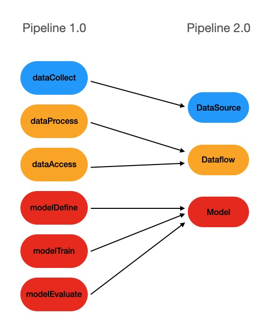

# How to Write Pipcook Script

## Background

Pipcook 2.0 has made a lot of features and performance optimizations to make it easier for users to use in a simpler way. The closest part to users is the Pipcook script. As we know, in 1.0, Pipeline was made up of several npm packages, including dataCollect, dataProcess/datasetProcess, dataAccess, modelDefine, modelTrain, modelEvaluate. Since the implementation of the plugin is based on npm packages, there will inevitably be a process of npm package distribution and dependency installation, which brings some troubles to users. For developers, debugging a plugin requires compiling, packaging, publishing (npm publish or npm link), installing, and running, especially for installation. For users, there are often multiple plugins that rely on the same package when using the plugin. npm checks for duplicate node dependencies, but python dependencies do not, so there is the problem of duplicate python dependencies being installed, and the process of installing plugins can be painful.

To solve these problems, we use Pipcook script instead of plugin to compose the pipeline. The biggest difference is that Pipcook script does not require a package manager like npm, it will be distributed through a URI like `http://github.com/my/pipcook-script.js`, and it is a bundled script, so there are no additional dependencies. In this way, Script development, debugging, and installation will become very lightweight: it is just downloading/copying a bundle script through a URI. However, this brings another problem: python dependencies and binary node dependencies cannot be bundled, so we introduced the concept of Framework to maintain these dependencies on the mirror by pre-compiling and packaging, and then downloading them when using them. We will cover the Framework in more detail in a subsequent article.

The types of Script are reduced to DataSource, Dataflow and Model, which correspond to the plugin as follows.



Next, let's take a look at how to implement an ML pipeline with the Pipcook script, using addition-rnn as an example.

## Pipeline 2.0

In order to write the script, we need to understand the Pipeline 2.0 data structure first.

```json
{
  "specVersion": "2.0",
  "dataSource": "http://host/data-source-script.js?url=http://host/dataset.zip",
  "dataflow": [
    "http://host/dataflow-script.js?&param=addition"
  ],
  "model": "http://host/addition-script.js",
  "artifacts": [{
    "processor": "pipcook-artifact-zip@0.0.2",
    "target": "/home/pipcook/addition-rnn-model.zip"
  }],
  "options": {
    "framework": "tfjs@2.8.3",
    "train": {
      "epochs": 10,
      "validationRequired": true
    }
  }
}
```

* specVersion: pipeline version number, currently `2.0`.
* dataSource: DataSource script address, this script implements access to the data source, supports url, local path. we can define script parameters by query, e.g.: `file://home/pipcook/datasource.js?url=http://oss.host.com/dataset.zip`, which will run the script located at `/home/pipcook/datasource.js` on the local disk, with the script parameter `{ url: 'http://oss.host.com/dataset.zip' }`.
* dataflow: array of dataflow script URI, this script implements transformations of data, such as resize, normalize, rotate, crop, salt, etc., and provides api to access the transformed data, Pipcook will execute the scripts in dataflow in the defined order.
* model: model script address, which implements define, train, evaluate, and output models.
* artifacts: an array of processing plugins for the model output, the plugins in the array will also be called by Pipcook in order. The plugins in the example implement compression of the model files.
* options: contains the definition of framework and the definition of train parameters. framework definition supports url, local path, or framework name, Pipcook will look for the corresponding framework resource file on the default framework mirror.

## Implementing Script

Next, let's take [addition-rnn](https://github.com/tensorflow/tfjs-examples/tree/master/addition-rnn) as an example to see how to implement the DataSource Dataflow, and Model scripts to build a pipeline.
We can generate a template project from a template by scaffolding.

```sh
$ npm init pipcook-script all my-scripts js && cd my-scripts
$ tree -L 1
.
├── LICENSE
├── README.md
├── debug
├─ node_modules
├── package-lock.json
├── package.json
├── src
└─ webpack.config.js
$ tree ./src
./src
├── dataflow.js
├── datasource.js
├── index.js
└── model.js
```

The project directory contains the basic configuration needed to implement the script:
1. Webpack configuration: we use webpack to bundle the script into a single js file.
2. Basic dependencies: `@pipcook/core` to introduce script entry function types, etc., `@pipcook/datacook` to implement the data processing.
3. Debug configuration: the configuration required to debug the script.

`src` is the source code directory, includes:

* index.js: Entry file, unified export DataSource, Dataflow, Model entry.
* datasource.js: DataSource Script implementation.
* dataflow.js: Dataflow Script implementation.
* model.js: Model Script implementation.

### DataSource

DataSource Script is the first script the pipeline runs, it fetches the data and provides other scripts [Dataset](#) API for reading sample data, it needs to export an [entry function](https://alibaba.github.io/pipcook/typedoc/script/index.html#datasourceentry), Dataset is the interface to access data, different datasources will contain different types of samples, we can create a Dataset instance as defined by the interface, but this is not necessary in most scenarios, `datacook` provides a tool method [makeDataset](#) that allows us to create Dataset instances easily.

Let's look at `src/datasource.js`.

```js
/*
 * This is the entry of datasource script
 */
module.exports = async (options, context) => {
  let {
    // options from query, note that their types are `srting` or `string[]`
  } = options;
  // should get the instance of datacook from context
  const dataCook = context.dataCook;
  dataCook = context.dataCook; /**
   * create dataset here
   */
  const trainData = [ { label: 'label-1', data: 'data-1' }, { label: 'label-2', data: 'data-2' } ];
  const testData = [ { label: 'label-1', data: 'data-1' }, { label: 'label-2', data: 'data-2' } ];
  const meta = {
    type: dataCook.Dataset.Types.DatasetType.General,
    size: {
      test: testData.length,
      train: trainData.length
    }
  };
  return dataCook.Dataset.makeDataset({ trainData, testData }, meta);
};

```

In this example, we need to randomly generate a given number of equations and answers according to a given character length, and the complete implementation is as follows.

```js
/**
 * Generate examples.
 *
 * Each example consists of a question, e.g., '123+456' and and an
 * answer, e.g., '579'.
 *
 * @param digits Maximum number of digits of each operand of the
 * @param numExamples Number of examples to generate.
 * @param invert Whether to invert the strings in the question.
 * @returns The generated examples and digit array.
 */
function generateData(digits, numExamples, invert = false) {
    const digitArray = ['0', '1', '2', '3', '4', '5', '6', '7', '8', '9'];
    const arraySize = digitArray.length;

  const output = [];
  const maxLen = digits + 1 + digits;

  const f = () => {
    let str = '';
    while (str.length < digits) {
      const index = Math.floor(Math.random() * arraySize);
      str += digitArray[index];
    }
    return parseInt(str);
  };

  const seen = new Set();
  while (output.length < numExamples) {
    const a = f();
    const b = f();
    const sorted = b > a ? [a, b] : [b, a];
    const key = sorted[0] + '`' + sorted[1];
    if (seen.has(key)) {
      continue;
    }
    seen.add(key);

    // Pad the data with spaces such that it is always maxLen.
    const q = `${a}+${b}`;
    const query = q + ' '.repeat(maxLen - q.length);
    let ans = (a + b).toString();
    // Answer can be of maximum size `digits + 1`.
    ans += ' '.repeat(digits + 1 - ans.length);

    if (invert) {
      throw new Error('invert is not implemented yet');
    }
    output.push([query, ans]);
  }
  return output;
}

/**
 * This is the entry of datasource script
 */
module.exports = async (options, context) => {
    // 1
    let {
    digits = '2',
    numExamples = '100'
    } = options;
    digits = parseInt(digits);
    numExamples = parseInt(numExamples);
    // 2
    const dataCook = context.dataCook;
    // 3
    const data = generateData(digits, numExamples);
    const split = Math.floor(numExamples * 0.9);
    const trainData = data.slice(0, split).map(item => ({ label: item[1], data: item[0] }));
    const testData = data.slice(split).map(item => ({ label: item[1], data: item[0] }));
    // 4
    const meta = {
    type: dataCook.Dataset.Types.DatasetType.General,
    size: {
      test: testData.length,
      train: trainData.length
    }
    };
    // 5
    return dataCook.Dataset.makeDataset({ trainData, testData }, meta);
};
```

1. We need to read the parameters from options, `digits` is the width of the numeric characters involved in the calculation, and `numExamples` is the number of randomly generated samples. Since these parameters are retrieved from the query of the script uri, we convert the string parameters to `number` type.
2. Get the `dataCook` component from the `context`.
3. Next, call the `generateData` method to generate the arithmetic and result strings, splitting the training data and test data in a 9:1 ratio. The `makeDataset` method requires two arrays of type [Sample]() as input, so we construct a map of the generated equations and result strings into Sample format.
4. Construct the dataset metadata [DatasetMeta]() for subsequent processing.
5. Call `makeDataset` to construct the `Dataset` object and return it.

### Dataflow

In pipeline, Dataflow is an array that is executed in defined order after the DataSource, and it needs to export an [entry function](https://alibaba.github.io/pipcook/typedoc/script/index.html#dataflowentry), which accepts the Dataset object, script options and context, and returns a new Dataset object. We can process sample objects in the Dataflow script, such as `resize` and `normalize` for images, `encode` for text, etc. The input of each Dataflow is the output of the previous script. In this example, we need to encode and convert the arithmetic and result string into a Tensor, so the Dataset output from the DataSource Script is passed into this Dataflow script, which then outputs an encoded and converted Dataset object as follows.

```js
let tf = null;

class CharacterTable {
  /**
   * Constructor of CharacterTable.
   * @param chars A string that contains the characters that can appear
   * in the input.
      */
    constructor(chars) {

    this.chars = chars;
    this.chars = chars; this.charIndices = {};
    this.size = this.chars.length;
    for (let i = 0; i < this.size; ++i) {
      const char = this.chars[i];
      if (this.charIndices[char] ! = null) {
        throw new Error(`Duplicate character '${char}'`);
      }
      this.charIndices[this.chars[i]] = i;
    }
  }

  /**
   * Convert a string into a one-hot encoded tensor.
      *
   * @param str The input string.
   * @param numRows Number of rows of the output tensor.
   * @returns The one-hot encoded 2D tensor.
   * @throws If `str` contains any characters outside the `CharacterTable`'s
   * vocabulary.
      */
    encode(str, numRows) {

    const buf = tf.buffer([numRows, this.size]);
    for (let i = 0; i < str.length; ++i) {
      const char = str[i];
      if (this.charIndices[char] == null) {
        throw new Error(`Unknown character: '${char}'`);
      }
      buf.set(1, i, this.charIndices[char]);
    }
    return buf.toTensor().as2D(numRows, this.size);
  }
}

module.exports =
async (dataset, options, context) => {
  // 1
  let { digits } = options;
  digits = parseInt(digits);
  // 2
  const datacook = context.dataCook;
  tf = await context.importJS('@tensorflow/tfjs');
  // 3
  const characterTable = new CharacterTable('0123456789+ ');
  return datacook.Dataset.transformSampleInDataset(async (sample) => {
    return {
      label: characterTable.encode(sample.label, digits + 1),
      data: characterTable.encode(sample.data, digits + 1 + digits)
    };
  }, dataset);
};
```

1. Read the parameter obtained from Script URI, `digits` is the width of the numeric characters involved in the calculation.
2. Get `dataCook` and `@tensorflow/tfjs`, `dataCook` is a Pipcook built-in component that can be fetched directly from `context`, `@tensorflow/tfjs` is a JS component referenced from the Framework and can be import by `context.importJS` or `context.importPY` if you are importing Python components.
3. Create the encoder object, encode the label and data in Sample, and then call [transformSampleInDataset]() to create the Dataset interface, you need to pass in the transform function and the incoming Dataset object.

### Model
So far, we have implemented a DataSource script, a Dataflow script, and can read the sample object containing the two Tensors from the Dataset, and then the last part: implementing a Model script that defines the ML model object and the training logic. It's also required to export an [entry function](https://alibaba.github.io/pipcook/typedoc/script/index.html#modelentry).

```js
let tf = null;

function createAndCompileModel(
  hiddenSize, rnnType, digits, vocabularySize
) {
  const maxLen = digits + 1 + digits;
  const model = tf.sequential();
  switch (rnnType) {
    case 'SimpleRNN':
      model.add(tf.layers.simpleRNN({
        units: hiddenSize,
        recurrentInitializer: 'glorotNormal',
        inputShape: [maxLen, vocabularySize]
      }));
      break;
    case 'GRU':
      model.add(tf.layers.gru({
        units: hiddenSize,
        recurrentInitializer: 'glorotNormal',
        inputShape: [maxLen, vocabularySize]
      }));
      break;
    case 'LSTM':
      model.add(tf.layers.lstm({
        units: hiddenSize,
        recurrentInitializer: 'glorotNormal',
        inputShape: [maxLen, vocabularySize]
      }));
      break;
    default:
      throw new Error(`Unsupported RNN type: '${rnnType}'`);
  }
  model.add(tf.layers.repeatVector({
    n: digits + 1
  }));
  switch (rnnType) {
    case 'SimpleRNN':
      model.add(tf.layers.simpleRNN({
        units: hiddenSize,
        recurrentInitializer: 'glorotNormal',
        returnSequences: true
      }));
      break;
    case 'GRU':
      model.add(tf.layers.gru({
        units: hiddenSize,
        recurrentInitializer: 'glorotNormal',
        returnSequences: true
      }));
      break;
    case 'LSTM':
      model.add(tf.layers.lstm({
        units: hiddenSize,
        recurrentInitializer: 'glorotNormal',
        returnSequences: true
      }));
      break;
    default:
      throw new Error(`Unsupported RNN type: '${rnnType}'`);
  }
  model.add(tf.layers.timeDistributed({
    layer: tf.layers.dense({
      units: vocabularySize
    })
  }));
  model.add(tf.layers.activation({
    activation: 'softmax'
  }));
  model.compile({
    loss: 'categoricalCrossentropy',
    optimizer: 'adam',
    metrics: ['accuracy']
  });
  return model;
}

async function train(rt, model, epochs, batchSize) {
  const {
    dataSource,
    notifyProgress
  } = rt;
  // get dataset metadata
  const meta = await dataSource.getDatasetMeta();
  // seek to 0
  await dataSource.train.seek(0);
  // read all train data
  const trainSamples = await dataSource.train.nextBatch(meta.size.train);
  if (!trainSamples || trainSamples.length === 0) {
    throw new TypeError('no train data.');
  }
  const xs = [];
  const ys = [];
  trainSamples.forEach(sample => {
    xs.push(sample.data);
    ys.push(sample.label);
  });
  const xs3D = tf.stack(xs);
  const ys3D = tf.stack(ys);

  // shuffle test data
  dataSource.test.shuffle();
  // read all test data
  let testSamples = await dataSource.test.nextBatch(meta.size.test);
  if (testSamples.length === 0) {
    throw new TypeError('invalid test dataset');
  }
  const testXs = [];
  const testYs = [];
  testSamples.forEach(sample => {
    testYs.push(sample.label);
    testXs.push(sample.data);
  });
  const testXs3D = tf.stack(testXs);
  const testYs3D = tf.stack(testYs);

  // train and report progress on every epoch
  await model.fit(xs3D, ys3D, {
    epochs,
    batchSize,
    validationData: [ testXs3D, testYs3D ],
    callbacks: {
      onEpochEnd: (epoch, logs) => {
        notifyProgress({
          value: ((epoch + 1) / epochs) * 100,
          extendData: {
            epoch,
            logs
          }
        });
      }
    }
  });
}

module.exports = async (rt, options, context) => {
  let {
    digits = '2',
    rnnLayerSize,
    rnnType = 'SimpleRNN',
    vocabularySize = '12',
    epochs = '10',
    batchSize = '32'
  } = options;
  digits = parseInt(digits);
  rnnLayerSize = parseInt(rnnLayerSize);
  vocabularySize = parseInt(vocabularySize);
  epochs = parseInt(epochs);
  batchSize = parseInt(batchSize);
  tf = await context.importJS('@tensorflow/tfjs-node');
  const model = createAndCompileModel(rnnLayerSize, rnnType, digits, vocabularySize);
  await train(rt, model, epochs, batchSize);
  await model.save(`file://${context.workspace.modelDir}`);
  await rt.saveModel(context.workspace.modelDir);
};
```

1. As with other scripts, we first take the parameters from the URI and perform the type conversion.
2. import `@tensorflow/tfjs` from Framework.
3. Create and compile the model object based on the hyperparameters passed in.
4. Pass in the runtime object containing the Dataset and train the model.
5. Save the model file and finish training.

## Debugging

We can install pipcook client with the following command:

```sh
$ npm install @pipcook/cli -g
$ pipcook -v
2.0.0
```

Then we can build a pipeline configuration file in the debug folder of the script project directory `addition-rnn.json`:

```json
{
  "specVersion": "2.0",
  "dataSource": "file:///path/to/my-scripts/src/index.js?digits=2&numExamples=100",
  "dataflow": [
    "file:///path/to/my-scripts/src/index.js?digits=2"
  ],
  "model": "file:///path/to/my-scripts/src/index.js",
  "options": {
    "framework": "tfjs@2.8.3",
    "train": {
      "epochs": 100,
      "validationRequired": true,
      "rnnLayerSize": 128,
      "digits": 2,
      "vocabularySize": 12,
      "batchSize": 32
    }
  }
}
```

Create a new debug configuration file in the root of the script project:

```sh
$ mkdir .vscode
$ touch .vscode/launch.json
```

The configuration file is written to:

```json
{
  "version": "0.2.0",
  "configurations": [
    {
      "type": "pwa-node",
      "request": "launch",
      "name": "Launch Program",
      "skipFiles": [
        "<node_internals>/**"
      ],
      "runtimeExecutable": "pipcook",
      "runtimeArgs": [ "run", "${workspaceFolder}/debug/addition-rnn.json", "--output", "${workspaceFolder}/debug/workspace" ]
    }
  ]
}
```

Now we can press F5 in vs code to start debugging the scripts.
