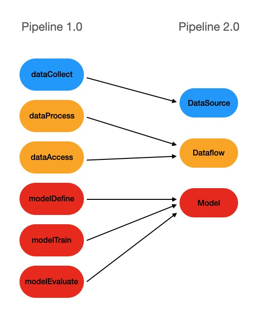

# 为 Pipcook 贡献脚本

Pipcook 欢迎开发者为我们贡献脚本以扩展 Pipcook 的功能。 本文将介绍如何开发脚本。 其中涉及的内容仅为建议，只要符合我们的脚本原型规范就可以在 Pipcook 中成功运行。

> 强烈建议您先了解我们定义的[脚本规范](../spec/script.md)。

## 从 v1.x 迁移

Pipcook 2.0 做了大量功能和性能优化，让开发者和用户可以以更简单的方式开发和使用。这其中常用的部分就是 Pipcook 脚本，我们知道，在 1.0，Pipeline 是由多个 npm 包组成的，包含 dataCollect，dataProcess/datasetProcess，dataAccess，modelDefine，modelTrain，modelEvaluate 这 5 类，我们称之为 Pipcook 插件。由于插件的实现基于 npm 包，在使用中就不可避免会存在 npm 包的分发，依赖安装等流程，这就给开发者和用户带来了一些麻烦和困扰。对开发者来说，调试插件需要经过编译，打包，发布（npm publish 或 npm link），安装，运行等步骤，特别是安装，如果插件通过 boa 依赖了 python 生态内的一些包，那么下载和安装将会耗费比较长的时间。对用户来说，使用插件时经常会出现多个插件依赖相同的包，npm 会对重复的 node 依赖进行检查，而 python 依赖则不会，所以存在 python 依赖重复安装的问题，特别是中国的 python 源本身不稳定，所以在中国网络下安装插件的过程也会比较痛苦。

为了解决这些问题，我们使用了 Pipcook 脚本代替了插件来构建 pipeline。两者最大的不同是脚本不需要 npm 这样的包管理器，它的分发将会通过像 `http://github.com/my/pipcook-script.js` 这样的 URI 实现。它本身就是一个经过 bundle 的脚本，所以也不存在额外的依赖。这样一来，脚本的开发调试，安装使用将变得非常轻量：就是通过 URI 下载/拷贝一个 bundle 后的脚本而已。但这样会带来另外的问题：python 依赖和二进制的 node 依赖无法 bundle，所以我们引入了 Framework 的概念来把这些依赖项通过预编译、打包后维护在 mirror 上，使用时下载即可。关于 Framework 我们将会在后续的文章中详细介绍。

脚本的类型被简化为 DataSource，Dataflow 和 Model，与插件的对应关系如下图：



接下来让我们以 mobilenet 为例，来看看如何通过 Pipcook 脚本实现一个 ML pipeline。

## Pipeline 2.0

为了编写脚本，我们需要先简单了解 Pipeline 2.0 数据结构：

```json
{
  "specVersion": "2.0",
  "datasource": "http://host/data-source-script.js?url=http://host/dataset.zip",
  "dataflow": [
    "http://host/dataflow-resize-script.js?size=224&size=224"
  ],
  "model": "http://host/model-script.js",
  "artifacts": [{
    "processor": "pipcook-artifact-zip@0.0.2",
    "target": "/home/pipcook/mobilenet-model.zip"
  }],
  "options": {
    "framework": "tfjs@3.8",
    "train": {
      "epochs": 10,
      "validationRequired": true
    }
  }
}
```

字段说明：

* `specVersion`：pipeline 版本号，目前为 `2.0` 。
* `datasource`：DataSource 脚本地址，这个脚本实现了对数据源的访问，支持 url、local path。我们可以通过 query 定义脚本参数，如：`file://home/pipcook/datasource.js?url=http://oss.host.com/dataset.zip`，将会运行本地磁盘上位于`/home/pipcook/datasource.js` 的脚本，脚本参数为 `{ url: 'http://oss.host.com/dataset.zip' }`。
* `dataflow`：dataflow 脚本地址的数组，这个脚本实现了对数据的转换，比如 resize，normalize，rotate，crop，salt 等，并提供了访问转换后数据的 api，Pipcook 会按定义顺序执行 dataflow 中的脚本。
* `model`：model 脚本地址，实现了模型的 define，train，evaluate，产出模型。
* `artifacts`：模型产出后的处理插件数组，数组内的插件也会按顺序被 Pipcook 调用。示例中的插件实现了对模型文件的压缩。
* `options`：包含 framework 的定义和 train 参数的定义，framework 的定义支持 url，local path，或 framework 名称，Pipcook 会在默认的 framework mirror 上寻找对应的 framework 资源文件。


## 实现脚本

接下来，让我们以 [addition-rnn](https://github.com/tensorflow/tfjs-examples/tree/master/addition-rnn) 为例，来看看如何实现 DataSource，Dataflow，Model 脚本从而构建出一条 pipeline。
我们可以通过脚手架从模板生成一个模板工程：

```sh
$ npm init pipcook-script all my-scripts js && cd my-scripts
$ tree -L 1
.
├── LICENSE
├── README.md
├── debug
├── node_modules
├── package-lock.json
├── package.json
├── src
└── webpack.config.js
$ tree ./src
./src
├── dataflow.js
├── datasource.js
├── index.js
└── model.js
```
工程目录内包含了实现脚本所需的基本配置：
1. webpack配置：我们使用 webpack 将脚本及其依赖 bundle 为单个 js 文件。
2. 基础依赖项：`@pipcook/core` 用于引入脚本入口函数类型等, `@pipcook/datacook` 实现数据处理的功能包。
3. debug 配置：调试脚本所需的配置。

`src`为源码目录，包含:

* index.js：入口文件，统一导出 DataSource，Dataflow，Model 入口。
* datasource.js：DataSource 脚本实现。
* dataflow.js：Dataflow 脚本实现。
* model.js：Model 脚本实现。

### DataSource

DataSource 脚本是 pipeline 运行的第一个脚本，它对接数据源，提供其他脚本 [Dataset](#) API 用于读取样本数据，它需要导出一个[入口函数](https://alibaba.github.io/pipcook/typedoc/script/index.html#datasourceentry)，Dataset 是访问数据的接口，不同的数据源会包含不同类型的样本，我们可以按照接口定义创建一个 Dataset 实例，但这在大部分场景下是不必要的，`datacook` 提供了一个工具方法 [makeDataset](#) 让我们可以方便地创建 Dataset 实例。

打开 `src/datasource.js`：

```js
/**
 * This is the entry of datasource script
 */
module.exports = async (options, context) => {
  let {
    // options from query, note that their types are `srting` or `string[]`
  } = options;
  // should get the instance of datacook from context
  const dataCook = context.dataCook;
  /**
   * create dataset here
   */
  const trainData = [ { label: 'label-1', data: 'data-1' }, { label: 'label-2', data: 'data-2' } ];
  const testData = [ { label: 'label-1', data: 'data-1' }, { label: 'label-2', data: 'data-2' } ];
  const meta = {
    type: dataCook.Dataset.Types.DatasetType.General,
    size: {
      test: testData.length,
      train: trainData.length
    }
  };
  return dataCook.Dataset.makeDataset({ trainData, testData }, meta);
};

```


在这个例子中，我们需要按照给定的字符长度随机生成给定数量的算式和答案，完整实现如下：

```js
/**
 * Generate examples.
 *
 * Each example consists of a question, e.g., '123+456' and and an
 * answer, e.g., '579'.
 *
 * @param digits Maximum number of digits of each operand of the
 * @param numExamples Number of examples to generate.
 * @param invert Whether to invert the strings in the question.
 * @returns The generated examples and digit array.
 */
function generateData(digits, numExamples, invert = false) {
  const digitArray = ['0', '1', '2', '3', '4', '5', '6', '7', '8', '9'];
  const arraySize = digitArray.length;

  const output = [];
  const maxLen = digits + 1 + digits;

  const f = () => {
    let str = '';
    while (str.length < digits) {
      const index = Math.floor(Math.random() * arraySize);
      str += digitArray[index];
    }
    return parseInt(str);
  };

  const seen = new Set();
  while (output.length < numExamples) {
    const a = f();
    const b = f();
    const sorted = b > a ? [a, b] : [b, a];
    const key = sorted[0] + '`' + sorted[1];
    if (seen.has(key)) {
      continue;
    }
    seen.add(key);

    // Pad the data with spaces such that it is always maxLen.
    const q = `${a}+${b}`;
    const query = q + ' '.repeat(maxLen - q.length);
    let ans = (a + b).toString();
    // Answer can be of maximum size `digits + 1`.
    ans += ' '.repeat(digits + 1 - ans.length);

    if (invert) {
      throw new Error('invert is not implemented yet');
    }
    output.push([query, ans]);
  }
  return output;
}

/**
 * This is the entry of datasource script
 */
module.exports = async (options, context) => {
  // 1
  let {
    digits = '2',
    numExamples = '100'
  } = options;
  digits = parseInt(digits);
  numExamples = parseInt(numExamples);
  // 2
  const dataCook = context.dataCook;
  // 3
  const data = generateData(digits, numExamples);
  const split = Math.floor(numExamples * 0.9);
  const trainData = data.slice(0, split).map(item => ({ label: item[1], data: item[0] }));
  const testData = data.slice(split).map(item => ({ label: item[1], data: item[0] }));
  // 4
  const meta = {
    type: dataCook.Dataset.Types.DatasetType.General,
    size: {
      test: testData.length,
      train: trainData.length
    }
  };
  // 5
  return dataCook.Dataset.makeDataset({ trainData, testData }, meta);
};
```

1. 我们需要从 options 中读取参数，`digits` 是参与计算的数字字符宽度，`numExamples` 是随机生成的样本数量。因为这几个参数是从脚本 uri 的 query 中获取的，所以我们将得到字符串参数转换为 `number` 类型。
2. 从 `context` 中获取 `dataCook` 组件。
3. 接下来调用 `generateData` 方法生成算式和结果字符串，按照 9：1 的比例分割训练数据和测试数据。`makeDataset` 方法需要输入为两个 [Sample][] 类型的数组，所以我们构造需要将生成的算式和结果字符串 map 成 Sample 格式。
4. 构造数据集元数据 [DatasetMeta][]，用于后续处理。
5. 调用 `makeDataset` 构造 `Dataset` 对象并返回。


### Dataflow

在 pipeline 中，Dataflow 是一个数组，在 DataSource 之后按定义顺序执行，它需要导出一个[入口函数](https://alibaba.github.io/pipcook/typedoc/script/index.html#dataflowentry)，接受 Dataset 对象，脚本 options 和 context，并返回一个新的 Dataset 对象。我们可以在 Dataflow 脚本中对 Sample 对象进行处理，比如图片的 `resize`、`normalize`，文本的 `encode`等。每一个 Dataflow 的输入是上一个脚本的输出。在这个例子中，我们需要把算式和结果字符串进行编码并转换成 Tensor，那么 DataSource 脚本中输出的 Dataset 会被传入到这个 Dataflow 脚本中，然后输出一个编码转换后的 Dataset 对象：

```js
let tf = null;

class CharacterTable {
  /**
   * Constructor of CharacterTable.
   * @param chars A string that contains the characters that can appear
   *   in the input.
   */
  constructor(chars) {
    this.chars = chars;
    this.charIndices = {};
    this.size = this.chars.length;
    for (let i = 0; i < this.size; ++i) {
      const char = this.chars[i];
      if (this.charIndices[char] !== null) {
        throw new Error(`Duplicate character '${char}'`);
      }
      this.charIndices[this.chars[i]] = i;
    }
  }

  /**
   * Convert a string into a one-hot encoded tensor.
   *
   * @param str The input string.
   * @param numRows Number of rows of the output tensor.
   * @returns The one-hot encoded 2D tensor.
   * @throws If `str` contains any characters outside the `CharacterTable`'s
   *   vocabulary.
   */
  encode(str, numRows) {
    const buf = tf.buffer([numRows, this.size]);
    for (let i = 0; i < str.length; ++i) {
      const char = str[i];
      if (this.charIndices[char] === null) {
        throw new Error(`Unknown character: '${char}'`);
      }
      buf.set(1, i, this.charIndices[char]);
    }
    return buf.toTensor().as2D(numRows, this.size);
  }
}

module.exports =
async (dataset, options, context) => {
  // 1
  let { digits } = options;
  digits = parseInt(digits);
  // 2
  const datacook = context.dataCook;
  tf = await context.importJS('@tensorflow/tfjs');
  // 3
  const characterTable = new CharacterTable('0123456789+ ');
  return datacook.Dataset.transformSampleInDataset(async (sample) => {
    return {
      label: characterTable.encode(sample.label, digits + 1),
      data: characterTable.encode(sample.data, digits + 1 + digits)
    };
  }, dataset);
};
```

1. 读取从脚本 URI 中获取的参数，`digits` 是参与计算的数字字符宽度。
2. 获取 `dataCook` 和 `@tensorflow/tfjs`，`dataCook` 是 Pipcook 内建的组件，可以直接从 `context` 获取，`@tensorflow/tfjs` 是从 Framework 中引用的 JS 组件，可以通过 `context.importJS` 导入，如果是导入 Python 组件可以使用 `context.importPY`。
3. 创建编码器对象，对 Sample 中的 label 和 data 进行编码，然后调用 [transformSampleInDataset][] 创建 Dataset 接口，需要传入转换函数和传入的 Dataset对象。

### Model

到目前为止，我们实现了一个 DataSource 脚本，一个 Dataflow 脚本，并且可以从 Dataset 中读取到 包含两个 Tensor 的 Sample 对象，接下来就是最后一个环节：实现一个 Model 脚本，定义模型和训练逻辑。Model 脚本同样需要导出一个[入口函数](https://alibaba.github.io/pipcook/typedoc/script/index.html#modelentry)，

```js
let tf = null;

function createAndCompileModel(
  hiddenSize, rnnType, digits, vocabularySize
) {
  const maxLen = digits + 1 + digits;
  const model = tf.sequential();
  switch (rnnType) {
    case 'SimpleRNN':
      model.add(tf.layers.simpleRNN({
        units: hiddenSize,
        recurrentInitializer: 'glorotNormal',
        inputShape: [maxLen, vocabularySize]
      }));
      break;
    case 'GRU':
      model.add(tf.layers.gru({
        units: hiddenSize,
        recurrentInitializer: 'glorotNormal',
        inputShape: [maxLen, vocabularySize]
      }));
      break;
    case 'LSTM':
      model.add(tf.layers.lstm({
        units: hiddenSize,
        recurrentInitializer: 'glorotNormal',
        inputShape: [maxLen, vocabularySize]
      }));
      break;
    default:
      throw new Error(`Unsupported RNN type: '${rnnType}'`);
  }
  model.add(tf.layers.repeatVector({
    n: digits + 1
  }));
  switch (rnnType) {
    case 'SimpleRNN':
      model.add(tf.layers.simpleRNN({
        units: hiddenSize,
        recurrentInitializer: 'glorotNormal',
        returnSequences: true
      }));
      break;
    case 'GRU':
      model.add(tf.layers.gru({
        units: hiddenSize,
        recurrentInitializer: 'glorotNormal',
        returnSequences: true
      }));
      break;
    case 'LSTM':
      model.add(tf.layers.lstm({
        units: hiddenSize,
        recurrentInitializer: 'glorotNormal',
        returnSequences: true
      }));
      break;
    default:
      throw new Error(`Unsupported RNN type: '${rnnType}'`);
  }
  model.add(tf.layers.timeDistributed({
    layer: tf.layers.dense({
      units: vocabularySize
    })
  }));
  model.add(tf.layers.activation({
    activation: 'softmax'
  }));
  model.compile({
    loss: 'categoricalCrossentropy',
    optimizer: 'adam',
    metrics: ['accuracy']
  });
  return model;
}

async function train(rt, model, epochs, batchSize) {
  const {
    dataSource,
    notifyProgress
  } = rt;
  // get dataset metadata
  const meta = await dataSource.getDatasetMeta();
  // seek to 0
  await dataSource.train.seek(0);
  // read all train data
  const trainSamples = await dataSource.train.nextBatch(meta.size.train);
  if (!trainSamples || trainSamples.length === 0) {
    throw new TypeError('no train data.');
  }
  const xs = [];
  const ys = [];
  trainSamples.forEach(sample => {
    xs.push(sample.data);
    ys.push(sample.label);
  });
  const xs3D = tf.stack(xs);
  const ys3D = tf.stack(ys);

  // shuffle test data
  dataSource.test.shuffle();
  // read all test data
  let testSamples = await dataSource.test.nextBatch(meta.size.test);
  if (testSamples.length === 0) {
    throw new TypeError('invalid test dataset');
  }
  const testXs = [];
  const testYs = [];
  testSamples.forEach(sample => {
    testYs.push(sample.label);
    testXs.push(sample.data);
  });
  const testXs3D = tf.stack(testXs);
  const testYs3D = tf.stack(testYs);

  // train and report progress on every epoch
  await model.fit(xs3D, ys3D, {
    epochs,
    batchSize,
    validationData: [ testXs3D, testYs3D ],
    callbacks: {
      onEpochEnd: (epoch, logs) => {
        notifyProgress({
          value: ((epoch + 1) / epochs) * 100,
          extendData: {
            epoch,
            logs
          }
        });
      }
    }
  });
}

module.exports = async (rt, options, context) => {
  let {
    digits = '2',
    rnnLayerSize,
    rnnType = 'SimpleRNN',
    vocabularySize = '12',
    epochs = '10',
    batchSize = '32'
  } = options;
  digits = parseInt(digits);
  rnnLayerSize = parseInt(rnnLayerSize);
  vocabularySize = parseInt(vocabularySize);
  epochs = parseInt(epochs);
  batchSize = parseInt(batchSize);
  tf = await context.importJS('@tensorflow/tfjs-node');
  const model = createAndCompileModel(rnnLayerSize, rnnType, digits, vocabularySize);
  await train(rt, model, epochs, batchSize);
  await model.save(`file://${context.workspace.modelDir}`);
  await rt.saveModel(context.workspace.modelDir);
};
```

1. 与其他脚本一样，我们先从 URI 中获取参数，并进行类型转换。
2. 从 Framework 中导入 `@tensorflow/tfjs`。
3. 根据传入的超参数创建并编译 model 对象。
4. 传入包含 Dataset 的 runtime 对象，训练模型。
5. 保存模型文件，训练结束。

## 调试

我们可以通过以下命令安装 pipcook client：

```sh
$ npm install @pipcook/cli -g
$ pipcook -v
2.0.0
```

然后我们就可以在脚本工程目录的 debug 文件夹下构建一个 pipeline 配置文件 `addition-rnn.json`：

```json
{
  "specVersion": "2.0",
  "dataSource": "file:///path/to/my-scripts/src/index.js?digits=2&numExamples=100",
  "dataflow": [
    "file:///path/to/my-scripts/src/index.js?digits=2"
  ],
  "model": "file:///path/to/my-scripts/src/index.js",
  "options": {
    "framework": "tfjs@2.8.3",
    "train": {
      "epochs": 20,
      "validationRequired": true,
      "rnnLayerSize": 128,
      "digits": 2,
      "vocabularySize": 12,
      "batchSize": 32
    }
  }
}
```

在脚本工程根目录新建一个调试配置文件：

```sh
$ mkdir .vscode
$ touch .vscode/launch.json
```

配置文件写入：

```
{
  "version": "0.2.0",
  "configurations": [
    {
      "type": "pwa-node",
      "request": "launch",
      "name": "Launch Program",
      "skipFiles": [
        "<node_internals>/**"
      ],
      "runtimeExecutable": "pipcook",
      "runtimeArgs": [ "run", "${workspaceFolder}/debug/addition-rnn.json", "--output", "${workspaceFolder}/debug/workspace" ]
    }
  ]
}
```

现在，我们可以在 vs code 中按下 F5 开始调试脚本了。


## 发布

如 [Pipeline](../manual/intro-to-pipeline.md) 中的介绍，脚本支持以 `http`，`https` 和 `file` 协议被引入 pipeline 中，以 `file` 协议引入时可以忽略协议头，如：

```json
{
  "datasource": "/data/my-datasource.js"
}
```

因此我们可以很方便地发布我们的脚本，如[官方脚本](https://github.com/imgcook/pipcook-script)，我们可以把脚本推送到 github，并通过诸如 [jsdelivr](https://www.jsdelivr.com/) 这样的 CDN 服务共享给其他开发者。
